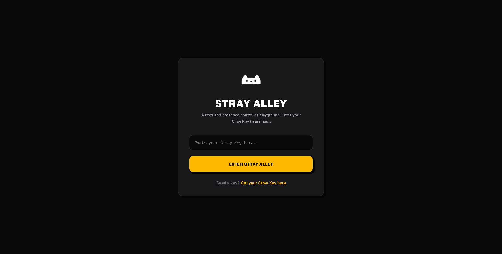
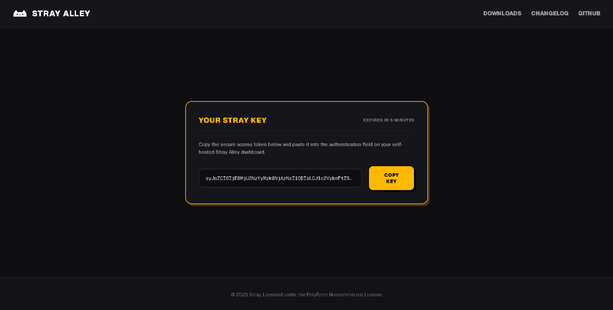
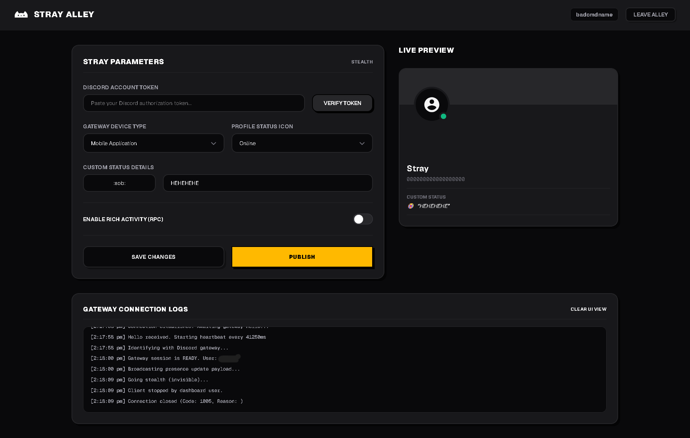

  

# Stray Alley (v2.2.3)

Stray Alley is a self-hosted, secure Discord presence playground built on Next.js. It features active session device spoofing, custom rich activity presence, and client connection management.

> [!WARNING]
> **Violation of Discord Terms of Service (ToS):** Operating selfbots or custom presence scripts on personal user accounts is against the Discord Terms of Service. Using this project could result in your account being permanently banned or restricted. Use at your own risk.

> [!CAUTION]
> **Keep Your Token Safe:** Your Discord Account Token gives full access to your account. Stray Alley encrypts your token locally in `db.json` using AES-256-GCM (automatically generating encryption keys on start), but you must ensure your host environment remains secure. Never share your token.

---

## Documentation

To install, configure, or troubleshoot Stray Alley, navigate to the documents below:

* **[Installation and Setup Guide](SETUP.MD):** Step-by-step local setup, cloud deployments (Render, Railway, etc.), and UptimeRobot keep-alive setup.
* **[Changelog](CHANGELOG.MD):** Detailed version history and features summary.

---

## Previews

  

  

  

---

## Perks & Key Benefits

* **Interactive Live Preview:** A beautiful, responsive Discord profile card visualizer lets you configure and preview custom statuses and Rich Presence states instantly as you type.
* **Ultra-Low Latency (~7ms Handshake):** Lightweight Node.js WebSocket engine initiates connection handshakes and updates presence properties in milliseconds.
* **Stealth Log-Out:** Instantly goes invisible and offline when you stop the service, bypassing the usual 30-second to 2-minute Discord session timeout delay.
* **Live Connection Logging:** A built-in terminal log viewport displays gateway milestones (Hellos, Heartbeats, READY states, and error close codes) in real-time.
* **Zero Database Configuration:** Completely self-contained using a zero-dependency local JSON file database (`db.json`) that sets itself up on first boot.
* **Dynamic RPC Asset Loading:** Enter direct image URLs or application asset keys. The dashboard automatically resolves Developer Portal keys to the Discord CDN.
* **Emoji Integration:** Support for standard Unicode emojis and custom Discord emojis (including static and animated GIFs) directly inside status updates.
* **Device Spoofing:** Pretend you are logged in on a custom device (Mobile Android client, Desktop, Web, or Xbox console).

---

## Credits

Stray's base is built using connection payloads inspired by the [Ghost-Selfbot](https://github.com/ghostselfbot/ghost) project. Massive thanks to the original creator.

Stray's Auto-Quest Complete is built using [DQACS](https://github.com/aiko-chan-ai/Discord-Quest-Auto-Completion-Selfbot). Massive thanks to the original creator.

---

## License

Stray is licensed under the **PolyForm Noncommercial License 1.0.0**. See the `LICENSE.MD` file for details.
